# MoveYourself
Aplikacja na zaliczenie przedmiotu "Programowanie aplikacji bazodanowych"

Nazwa: Move Yourself

Semestr: IV

Autorki: Aleksandra Okrój, Natalia Skórowska

Opis:
Move Yourself to program umożliwiający zarządzanie klientami, zajęciami i rezerwacjami dla siłowni.
Aplikacja umożliwia zalogowanie się zarówno jako użytkownik jak i jako administrator systemu.

Aplikacja zawiera następujące widoki:
1. StartFrame - pierwszy ekran widoczny dla użytkownika, zawiera formularz logowania.

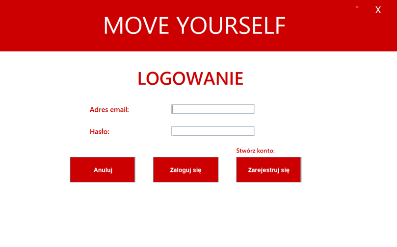 

2. RejestracjaFrame - zawiera formularz rejestracji. Aby założyć konto użytkownik musi podać: imię, nazwisko, adres email, datę urodzenia oraz hasło. Po udanej rejestracji wyświetla się informujący o tym alert

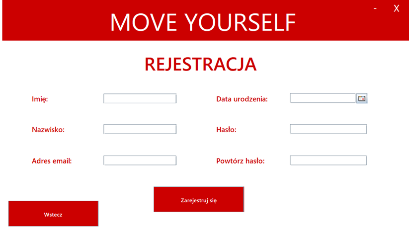 

3. KlientGlownaFrame - panel główny użytkownika, który zawiera przyciski umożliwiające przejście do pozostałych funkcjonalności dostępnych dla klienta.

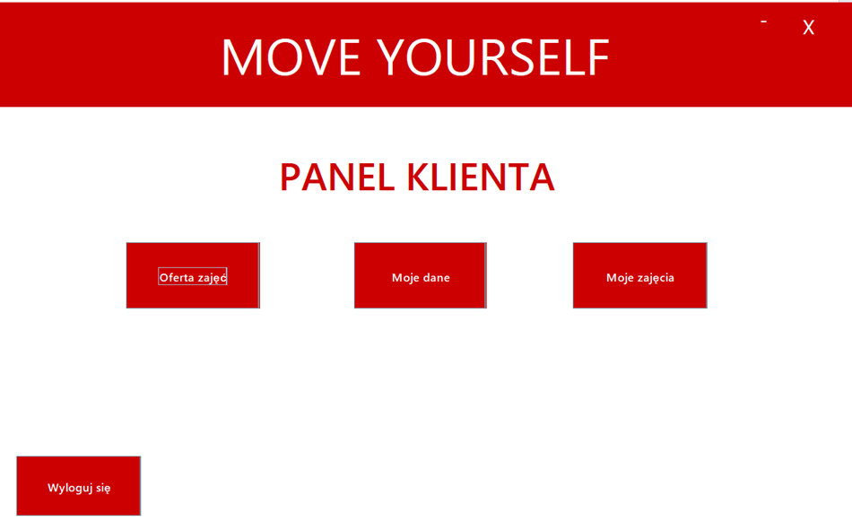 

4. MojeDaneFrame - widok przedstawia dane aktualnie zalogowanego użytkownika i jednocześnie umożliwia ich modyfikację.

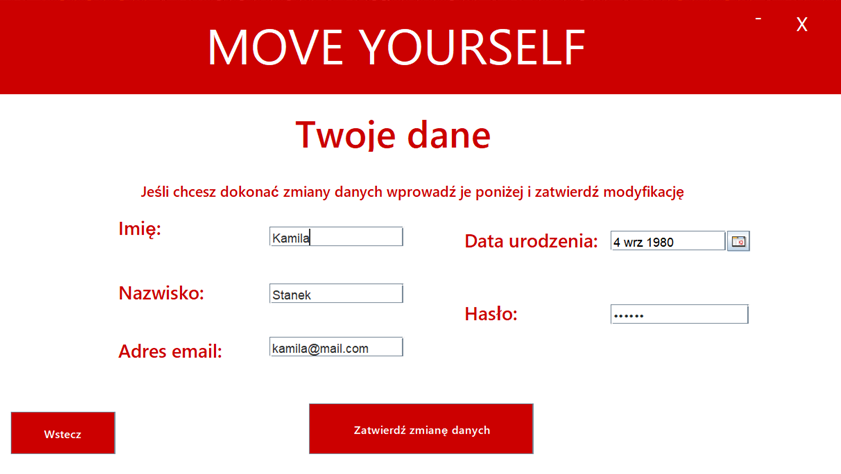 

5. ZajeciaFrame - widok umożliwiający przeglądanie oferty zajęć fitness, przechodzenie do kolejnych treningów możliwe przez przyciski nawigacyjne "następny" oraz "poprzedni". Bezpośrednio przy danej nazwie zajęć znajduje się przycisk umożliwiający zapisanie się na nie przez użytkownika.

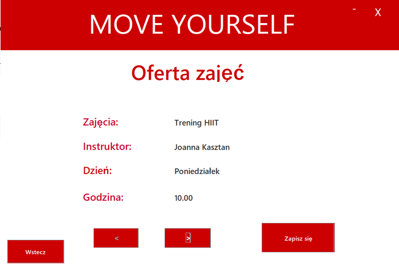 

6. MojeZajeciaFrame - widok ukazujący listę zajęć, na które zapisał się zalogowany obecnie użytkownik.

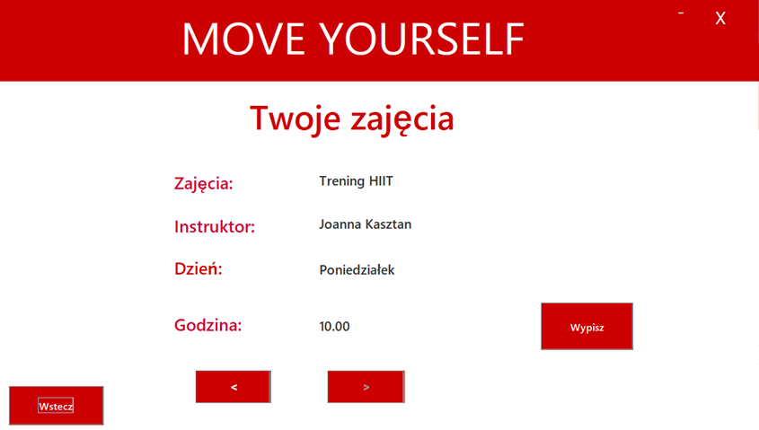 

7. AdminGlownaFrame - panel główny administratora, który umożliwa przejść do 5 funkcjonalności dostępnych dla osoby zarządzającej siłownią: przeglądanie zajęć, dodawanie zajęć, przeglądanie klientów, dodawanie klienta oraz wgląd w aktualne zapisy na zajęcia.

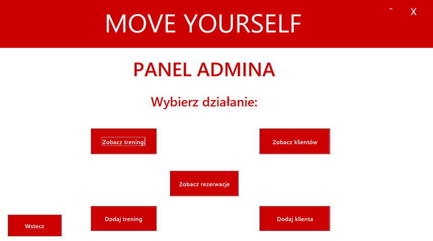 

8. DodajKlientaFrame - zawiera formularz dodawania nowego klienta do bazy przez administratora

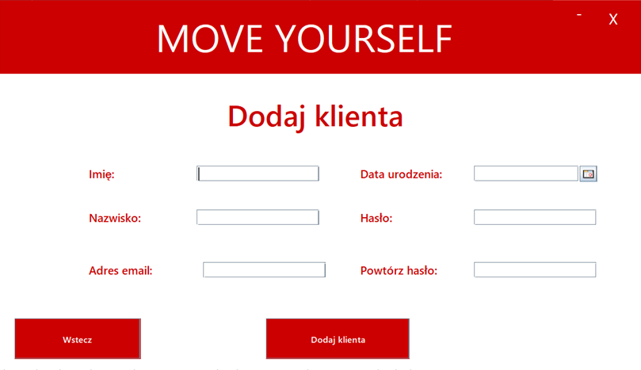 

9. DodajTreningFrame - zawiera formularz dodawania treningu przez administratora. Aby dodać trening należy podać następujące informacje: nazwę treningu, imie i nazwisko trenera, dzień tygodnia, godzinę.

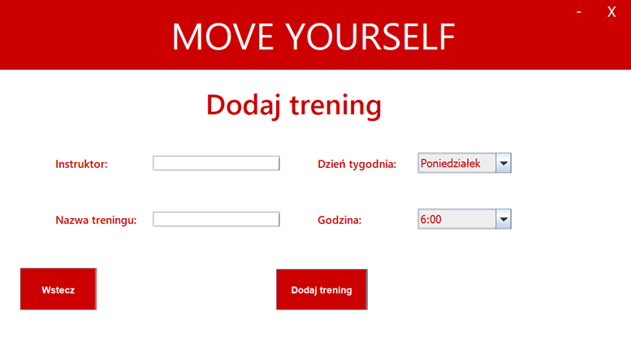 

10. ZobaczKlientówFrame - ukazuje listę klientów w formie tabeli.

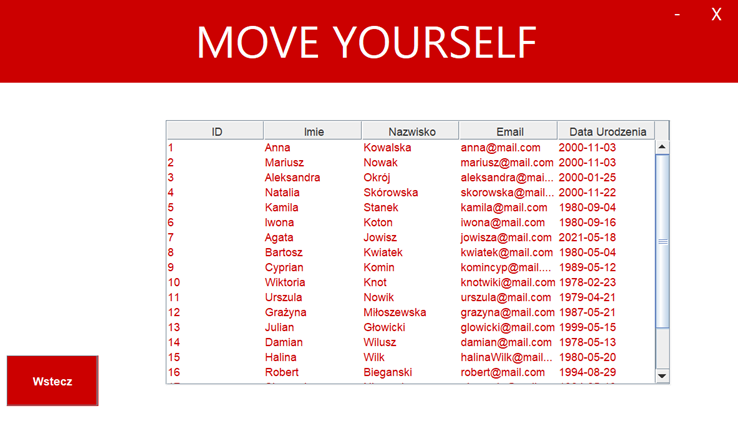 

11. ZobaczTreningiFrame - ukazuje ofertę zajęć.

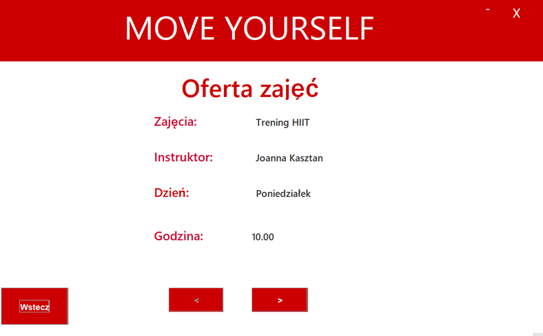 

12. ZobaczRezerwacjeFrame - ukazuje listę obecnych rezerwacji dokonanych przez klientów.

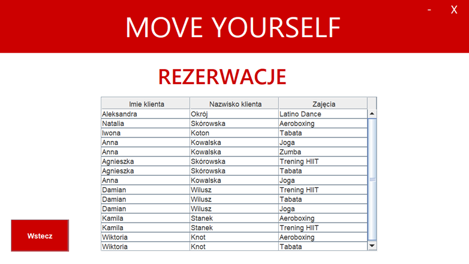 
